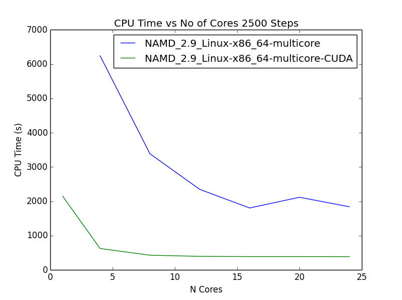
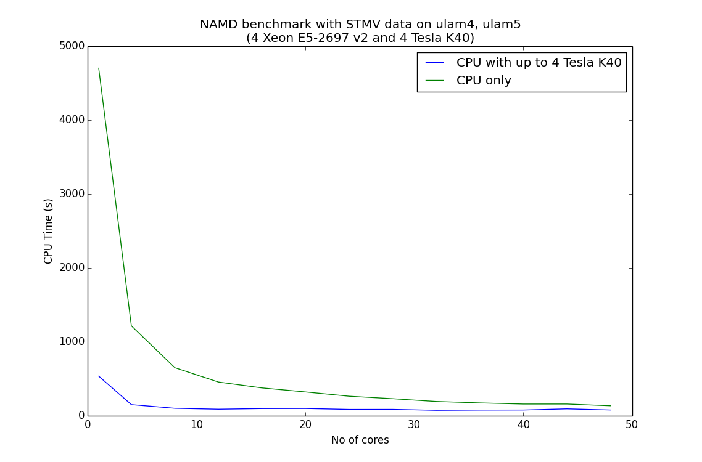

## Result on 1 node (24 cores)

## Result on 2 nodes (48 cores)

[Biowulf cluster CPU, GPU benchmark](http://biowulf.nih.gov/apps/namd-gpu.html)
[Biowulf cluster benchmark table](http://biowulf.nih.gov/apps/namd/namd_bench.html)